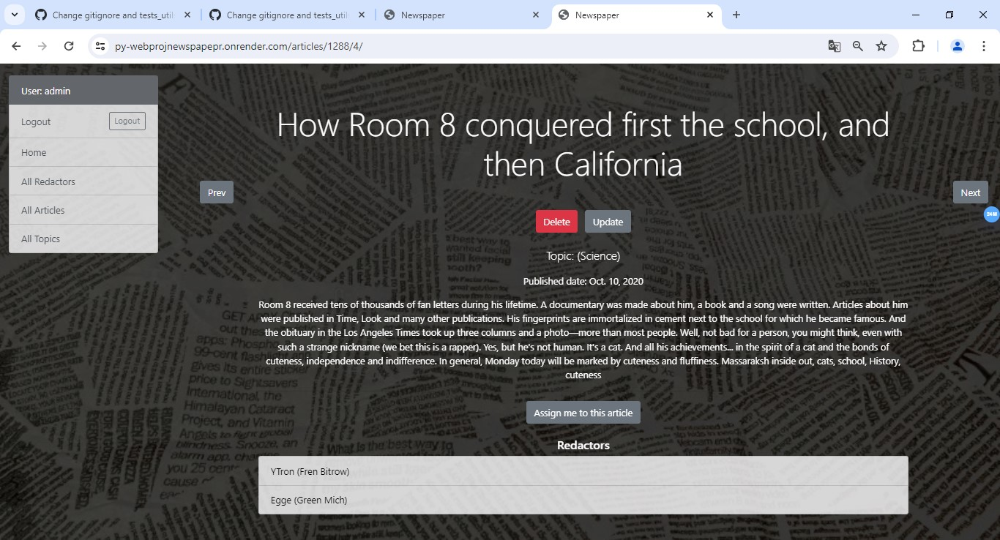

"_py_WebProjNewspapepr_" 

## Black's Newspaper

A small selection of articles about interesting stuff.

You can read the articles in the All Articles section. You can select the topic you are interested in the same section using a search in which a dot is used as a logical and, a comma is used as a logical or, and a minus is used as a logical not.

## **Acknowledgements**

[Templates fo Django:](https://dev.to/sm0ke/bootstrap-5-free-django-templates-4pi0)

[Soft UI Design Django](https://github.com/app-generator/django-soft-ui-design/tree/80b06c0fef43c983693e04b1ba25211104c461f2)

## Features
* Creating an article with your own editor and under a specific topic.
* Comprehensive single-level search by content, title and topic.
* Using multiple search schemes when working with articles.

## Check it out.
[Site in render](https://py-webprojnewspapepr.onrender.com)

## Demo

# Load data
[json file](db_data.json)

Use command python manage.py loaddata db_data.json
Test user:
    Username: admin
    Password: 1